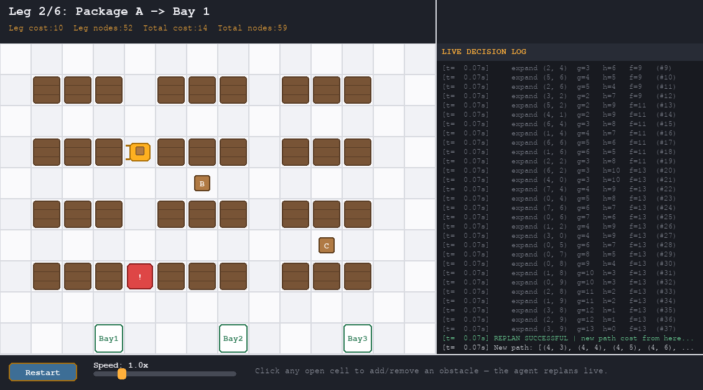

# Warehouse Logistics Agent — A* Search (Track 1)

**Unit 2 — Informed Search** · AI Express Hackathon

An autonomous forklift agent that picks up packages and delivers them to
loading bays in a grid warehouse full of static shelf obstacles, using
**A\* Search with the Manhattan-distance heuristic**:

```
h(n) = |x1 - x2| + |y1 - y2|
```

The agent drives itself around the warehouse autonomously — but the app is
also interactive: click any open cell to drop or remove an obstacle and
watch A\* replan live, drag the speed slider, or hit Restart. Everything
(grid, live decision log, HUD, and controls) lives in one Pygame window.

---

## 1. Team

| Field | Value |
|---|---|
| Course Code | *fill in* |
| Group ID | *fill in* |
| Members | *Name 1, Name 2, Name 3* |
| Track | Track 1 — Warehouse Logistics Agent (A\*) |
| Repository | *paste your GitHub URL here once pushed* |

See **[CONTRIBUTIONS.md](CONTRIBUTIONS.md)** for exactly who built what,
and **[scripts/GIT_WORKFLOW.md](scripts/GIT_WORKFLOW.md)** for ready-to-run
git commands to get all 3 members' commits into the repo.

---



## 2. What it does

- Grid warehouse with hand-designed shelf racks (static obstacles) laid out
  in aisles, so the agent must genuinely route around them rather than
  walk straight lines.
- **3 packages, 3 loading bays.** The forklift runs 6 A\* searches in
  sequence: dock → pkg A → bay 1 → pkg B → bay 2 → pkg C → bay 3,
  autonomously and continuously — no user input required for the agent
  to complete its job.
- **Interactive, not just autonomous:**
  - **Click any open cell** to drop or remove an obstacle at any time. If
    it blocks the path the forklift is currently driving, the agent
    detects it and replans live with A\* — you can trigger this as many
    times, wherever you like, instead of watching one scripted event.
    If you seal off every route, the agent safely parks and waits, then
    resumes automatically the moment you clear a path.
  - **Restart button** resets the whole simulation — grid, log, and agent.
  - **Speed slider** (0.5x–3x) scales movement live, no restart needed.
- **Everything lives in one window.** Grid on the left, a live, color-coded,
  auto-scrolling decision log on the right, a HUD bar on top (leg, path
  cost, nodes expanded), and the controls along the bottom.
- Timing is tuned so a full autonomous run (no clicking) takes about
  **48 seconds** at 1x speed — sized to fill the 45–60s "live
  demonstration" segment of the required video in one uncut take. Use the
  speed slider or click obstacles mid-run for extra material to show off.

## 3. PEAS summary (see SUMMARY.pdf for the full 1-page version)

| | |
|---|---|
| **Performance measure** | Total path cost (moves) across all deliveries, nodes expanded (search efficiency), all packages delivered, zero collisions with shelves |
| **Environment** | Discrete 14×10 grid warehouse, fully observable; static shelf layout plus obstacles the user may add/remove live, so only semi-predictable; single-agent |
| **Actuators** | Move Up / Down / Left / Right one cell; pick up package; drop off package |
| **Sensors** | Full grid-state knowledge (shelf/package/bay coordinates); obstacle-appearance detection that triggers live replanning |

---

## 4. Installation

### Requirements
- Python 3.9+
- pip

### Setup

```bash
# from the warehouse_agent/ folder
pip install -r requirements.txt
```

That's the only dependency — Pygame. Everything else (A\*, grid, logging,
UI widgets) is plain Python standard library.

### Platform notes

**Windows (recommended if you're on Windows):** just run Python and
`pip install -r requirements.txt` directly in PowerShell/Command Prompt or
your VS Code terminal — Pygame opens a normal window, no extra setup.

**WSL2 (Ubuntu):** Pygame needs a display. On Windows 11 with WSLg this
usually works out of the box. If you get a "no available video device"
error:
- Easiest fix: run the project from native Windows Python instead of
  inside WSL2, or
- Install an X server (e.g. VcXsrv) and `export DISPLAY=:0` before
  running, or
- Use `python main.py --test` to verify the whole simulation runs
  correctly headlessly (no window) while you sort out the display.

---

## 5. Running it

```bash
python main.py
```

A window opens (grid, live decision log, HUD, and the control bar) and the
forklift starts automatically after a short pause. Press **ESC** or close
the window to quit at any time.

**While it's running:**
- Click any open (non-shelf) cell to add an obstacle there; click it again
  to remove it. If the obstacle blocks the forklift's current path, watch
  the log panel — it'll show a `REPLAN TRIGGERED` line and the agent will
  reroute immediately.
- Drag the **Speed** slider to speed up or slow down the whole simulation.
- Click **Restart** to reset everything and run it again.

Just record this one window — grid, log, stats, and controls are all
visible inside it. The console also still prints everything (handy for
debugging), but it's not required for the video.

**Headless sanity check** (no window; confirms the install/logic works,
or for CI):
```bash
python main.py --test
```

**Run the tests:**
```bash
python tests/test_astar.py         # A* correctness: optimality, obstacle avoidance, reachability
python tests/test_interactive.py   # click-to-obstacle, live replanning, BLOCKED-state recovery
python tests/test_controls.py      # Button/Slider widget behavior
```

---

## 6. Tuning the demo

Everything is in `config.py`:

- `BASE_CELL_MOVE_MS` — milliseconds per cell at 1x speed. Default `950` →
  a full autonomous run takes about **48 seconds**. The in-app speed
  slider scales this live, so you usually won't need to touch this.
- `SPEED_MIN` / `SPEED_MAX` / `SPEED_DEFAULT` — range and starting value
  of the speed slider.
- `MISSIONS` — package/bay coordinates, easy to add a 4th package.
- Colors, window size, log panel width, control bar height, and pause
  durations are all here too.

---

## 7. Project structure

```
warehouse_agent/
├── main.py              # entry point: Pygame loop, mouse-event routing, --test mode
├── agent.py              # forklift state machine: plan -> move -> pickup/deliver,
│                          # live replanning, BLOCKED-state recovery
├── astar.py               # A* search + Manhattan heuristic (no Pygame dependency)
├── grid_map.py             # warehouse layout, walkability checks, obstacle toggling
├── visualizer.py            # all Pygame drawing code (grid, HUD, log panel)
├── controls.py               # Button and Slider UI widgets
├── logger.py                  # timestamped console + in-app log buffer
├── config.py                   # grid size, colors, timings, mission list
├── requirements.txt
├── build_summary_pdf.py         # regenerates SUMMARY.pdf if you edit the team/header info
├── CONTRIBUTIONS.md              # file-to-member ownership map
├── scripts/
│   ├── GIT_WORKFLOW.md            # step-by-step commit/push guide
│   ├── member1_commit.sh
│   ├── member2_commit.sh
│   └── member3_commit.sh
├── tests/
│   ├── test_astar.py               # optimality, obstacle avoidance, reachability
│   ├── test_interactive.py          # click-to-obstacle, live replan, BLOCKED recovery
│   └── test_controls.py              # Button/Slider widget behavior
├── assets/
│   └── demo_screenshot.png
└── SUMMARY.pdf                        # 1-page technical summary sheet
```

## 8. Algorithm notes

- **State space:** each state is a grid cell `(x, y)`; actions are the 4
  cardinal moves with uniform step cost 1.
- **Initial state / goal test:** the forklift's current cell / whether the
  current cell equals the leg's target cell (next package or next bay).
- **Path cost:** number of moves taken (`g(n)`), summed across all 6 legs.
- **Heuristic:** `h(n) = |x - goal_x| + |y - goal_y|` — Manhattan distance.
  It's admissible (never overestimates true cost on a 4-directional
  unit-cost grid) and consistent, so A\* is guaranteed to return the
  optimal path each leg.
- **Live replanning:** when a click adds an obstacle that blocks the
  path currently being driven, A\* re-runs from the agent's *current*
  cell to the same goal, treating the new obstacle as blocked. If no path
  exists at all, the agent enters a `BLOCKED` state and automatically
  retries the moment an obstacle is removed — see `agent.py`.

---

## 9. Submission checklist

- [ ] Push this whole folder to a public GitHub repo (see
      `scripts/GIT_WORKFLOW.md` for the 3-member commit sequence)
- [ ] Confirm all 3 members have visible commits: `git log --oneline`
      should show 3 different commit messages
- [ ] Fill in the Team table above and in `SUMMARY.pdf`
- [ ] Record the 60–90s video (grid + log + controls are all in one
      window now — no split screen needed). Consider showing a manual
      obstacle click mid-video to demonstrate live replanning on demand.
- [ ] Put `SUMMARY.pdf` in the repo root (already here) and upload it to
      the portal
- [ ] Paste the final repo URL into this README and into `SUMMARY.pdf`
